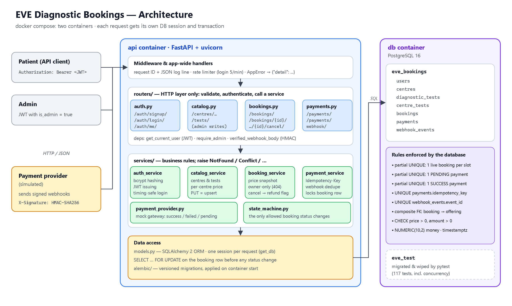
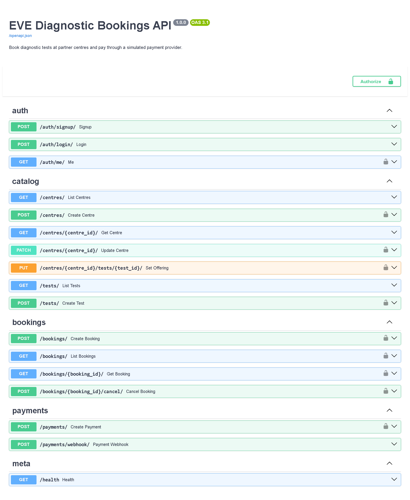
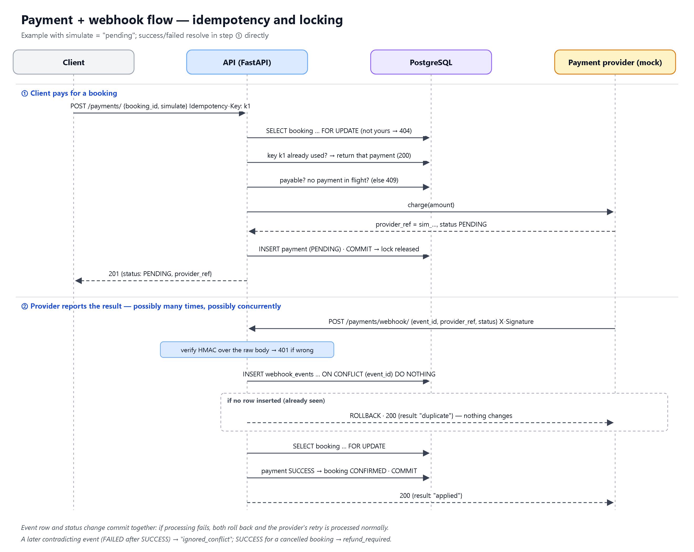
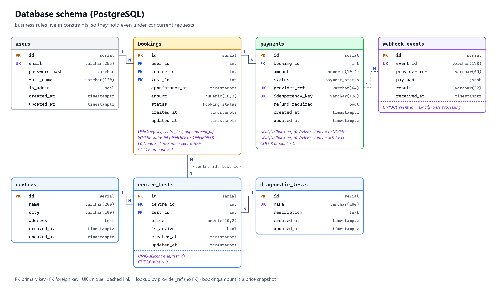
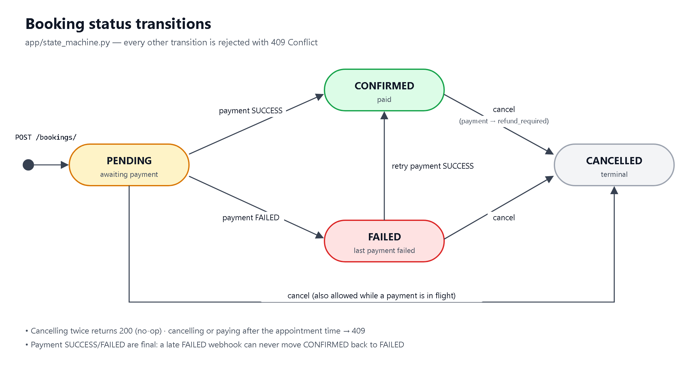

# EVE Diagnostic Bookings API

A backend service for booking diagnostic tests at centres and paying for them through a simulated payment provider.

**Stack:** FastAPI · PostgreSQL 16 · SQLAlchemy 2 · Alembic · pytest · Docker Compose

---

## Architecture



Two Docker containers: the **API** (FastAPI + uvicorn) and the **database** (PostgreSQL 16). Every request gets its own DB session and transaction. Middleware handles request IDs, JSON logging, rate limiting, and structured error responses. Routers delegate to the service layer; the service layer raises `NotFound`/`Conflict`; data access uses SQLAlchemy 2 ORM with `SELECT … FOR UPDATE` for concurrency safety.

---

## 1. How to run locally

**With Docker (recommended).** You need Docker Desktop running.

```bash
docker compose up -d --build                  # starts Postgres + API; migrations run automatically
docker compose exec api python -m app.seed    # demo centres, tests and an admin user
docker compose exec api pytest                # run the test suite
```

- API: http://localhost:8000
- Swagger UI: http://localhost:8000/docs
- Seeded admin: `admin@example.com` / `Admin@12345`



**Without Docker for the API** (Postgres still runs in Docker):

```bash
docker compose up -d db                   # Postgres on localhost:5433, plus the eve_test database
python -m venv .venv
.venv\Scripts\activate                    # Windows  (Linux/macOS: source .venv/bin/activate)
pip install -r requirements.txt
cp .env.example .env
alembic upgrade head
python -m app.seed
uvicorn app.main:app --reload
pytest
```

No external API keys are needed. Settings are environment variables; see [.env.example](.env.example).

---

## 2. API endpoints and example requests

Authenticated routes need the header `Authorization: Bearer <token>`. Errors always have the form `{"detail": ...}`.

| Method | Path | Auth | Description |
|---|---|---|---|
| POST | `/auth/signup/` | – | Create an account |
| POST | `/auth/login/` | – | Get a JWT (rate limited) |
| GET | `/auth/me/` | user | Current user |
| GET | `/centres/?city=&test_id=&page=&page_size=` | – | List centres |
| GET | `/centres/{id}/` | – | A centre with its tests and prices |
| POST | `/centres/` | admin | Create a centre |
| PATCH | `/centres/{id}/` | admin | Update a centre |
| PUT | `/centres/{id}/tests/{test_id}/` | admin | Set a test's price at a centre |
| GET | `/tests/` | – | Test catalogue |
| POST | `/tests/` | admin | Add a test |
| POST | `/bookings/` | user | Book a test |
| GET | `/bookings/?status=&page=` | user | Your bookings |
| GET | `/bookings/{id}/` | owner | A booking with its payments |
| POST | `/bookings/{id}/cancel/` | owner | Cancel a booking |
| POST | `/payments/` | owner | Pay for a booking (simulated) |
| POST | `/payments/webhook/` | HMAC signature | Payment status update from the provider |

### Example requests

```bash
# Sign up and log in
curl -X POST localhost:8000/auth/signup/ -H "Content-Type: application/json" \
  -d '{"email":"riya@example.com","password":"Riya12345","full_name":"Riya Sharma"}'

TOKEN=$(curl -s -X POST localhost:8000/auth/login/ -H "Content-Type: application/json" \
  -d '{"email":"riya@example.com","password":"Riya12345"}' | python -c "import sys,json;print(json.load(sys.stdin)['access_token'])")

# Centres and their prices
curl "localhost:8000/centres/?city=mumbai"
curl localhost:8000/centres/2/

# Book a test (appointment_at must be in the future and include a timezone)
curl -X POST localhost:8000/bookings/ -H "Authorization: Bearer $TOKEN" -H "Content-Type: application/json" \
  -d '{"centre_id":2,"test_id":1,"appointment_at":"2026-12-05T09:30:00+05:30"}'
# -> 201 {"id":1, "amount":"400.00", "status":"PENDING", ...}

# Pay. simulate = success | failed | pending (omit it for a random result)
curl -X POST localhost:8000/payments/ -H "Authorization: Bearer $TOKEN" -H "Content-Type: application/json" \
  -H "Idempotency-Key: 3f1c-demo" -d '{"booking_id":1,"simulate":"pending"}'
# -> 201 {"id":1, "status":"PENDING", "provider_ref":"sim_521f...", "booking_status":"PENDING", ...}
```

### Webhook

The simulated provider signs the raw request body with HMAC-SHA256 using `WEBHOOK_SECRET`:

```
POST /payments/webhook/
X-Signature: <hex HMAC-SHA256 of the body>

{"event_id": "evt_001", "provider_ref": "sim_521f...", "status": "SUCCESS"}
```

A helper script signs and sends the webhook. Sending the same event twice shows that the webhook is idempotent:

```bash
docker compose exec api python -m scripts.send_webhook sim_521f... SUCCESS --event-id evt_001
# 200 {"result":"applied", "payment_status":"SUCCESS", "booking_status":"CONFIRMED"}
docker compose exec api python -m scripts.send_webhook sim_521f... SUCCESS --event-id evt_001
# 200 {"result":"duplicate", ...}   <- same event again: nothing changes
```



---

## 3. Database / schema design



- **Price lives on `centre_tests`,** the table that links a centre to a test, because the same test costs different amounts at different centres.
- **`bookings.amount` is a copy of the price at booking time.** A later price change doesn't affect existing bookings.
- **A composite foreign key** from `bookings(centre_id, test_id)` to `centre_tests` guarantees that a booking can only reference a test the centre actually offers.
- **Payments are separate rows linked to a booking.** A failed attempt followed by a retry is fully recorded.
- **`webhook_events`** stores every processed event under a unique `event_id`. This is what makes the webhook idempotent.
- **Money is `NUMERIC(10,2)`**, and times are stored with timezones (`timestamptz`).

The database itself enforces the key business rules, so they hold even when requests arrive at the same time:

| Constraint | Guarantees |
|---|---|
| Partial unique index on (user, centre, test, appointment_at), where status is PENDING or CONFIRMED | No duplicate live bookings for a slot |
| Partial unique index on `payments(booking_id)`, where status is PENDING | At most one payment in progress per booking |
| Partial unique index on `payments(booking_id)`, where status is SUCCESS | A booking can't be charged twice |
| `payments.idempotency_key` UNIQUE | A retried `POST /payments/` doesn't charge again |
| `webhook_events.event_id` UNIQUE | Each webhook event is processed exactly once |
| `CHECK (price > 0)`, `CHECK (amount > 0)` | Prices and amounts are always positive |

Migrations are managed by Alembic ([alembic/versions](alembic/versions)).

---

## 4. Booking status state machine



A booking starts as **PENDING** (awaiting payment) and moves through the following states:

- `PENDING` → `CONFIRMED` on payment SUCCESS
- `PENDING` → `FAILED` on payment FAILED (retry is allowed)
- `FAILED` → `CONFIRMED` on retry payment SUCCESS
- Any non-terminal state → `CANCELLED` on explicit cancel (triggers `refund_required` flag if already paid)

Every other transition is rejected with `409 Conflict`. Cancelling twice returns `200` (no-op). Payment SUCCESS and FAILED are final — a late contradicting webhook event is ignored and logged.

---

## 5. Assumptions

- **Each booking is for one test at one centre.**
- **Centres have no capacity limit per time slot.** The only rule is that the same user can't hold two live bookings for the same test, centre and time.
- **Admins are users with `is_admin = true`**, created by the seed script; signup can't create one. Only admins can change centres, tests and prices; anyone can read them.
- **All amounts are in one currency (INR).**
- **The webhook is authenticated with a shared-secret HMAC signature, not a JWT,** because the caller is the payment provider, not a user. It identifies the payment by the provider's reference (`provider_ref`).
- **`POST /payments/` returns SUCCESS or FAILED immediately**, as the assignment asks. The extra option `simulate: "pending"` leaves the result to the webhook, which is how real gateways usually work.
- **SUCCESS and FAILED are final.** A later event that contradicts them (e.g. FAILED after SUCCESS) is ignored and logged; it doesn't change the booking.
- **Refunds are only flagged** (`refund_required = true`), for example when a paid booking is cancelled. They are not actually processed.
- **Another user's booking is reported as `404`, not `403`,** so the API doesn't reveal which booking IDs exist.

---

## 6. What I would improve with more time

- **A background job (Celery)** that checks with the provider on payments stuck in PENDING, and expires unpaid bookings.
- **A refund workflow** for payments marked `refund_required`.
- **Queued webhook processing:** accept the event immediately, then process it with a worker that retries failures and parks events that keep failing.
- **Time slots and capacity per centre,** with opening hours.
- **Webhook replay protection:** a timestamp in the signed payload, and a check that the event's amount matches the payment.
- **Refresh tokens and token revocation.**
- **Redis** for shared rate-limit storage and for caching the centre list.
- **CI** (GitHub Actions) running lint, type checks and the tests.
