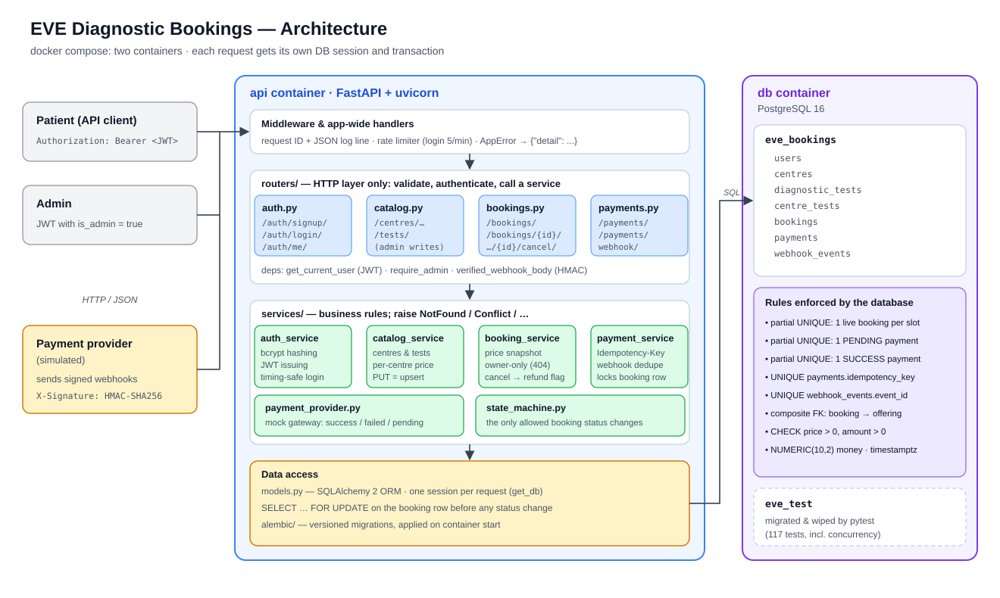
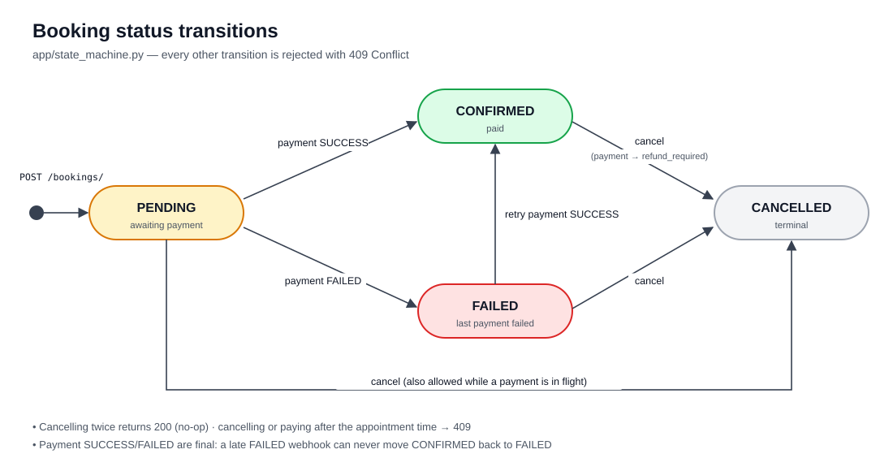
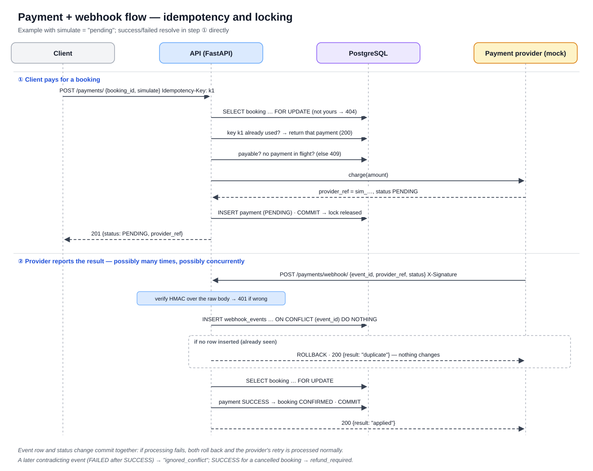

# Design notes

Details behind the implementation that go beyond the README: how the service is structured, the booking and payment rules, the edge cases the tests cover, and configuration. The API itself is documented in [API.md](API.md).

## Architecture



- **Two containers:** `api` (FastAPI) and `db` (PostgreSQL 16), started with `docker compose`.
- **Three layers inside the API:**
  - **routers** only handle HTTP: validation, authentication, and calling a service.
  - **services** hold the business rules and raise domain errors.
  - **models** map the database tables.
- **Concurrency safety:** every change to a booking or its payments first takes a row lock on the booking. Unique constraints in the database back this up.

All diagrams are in [images/](images/), as SVG with PNG copies.

---

## Project layout

```
app/
  main.py              app setup: routers, error handlers, request logging middleware
  config.py            settings from environment variables
  db.py  models.py     SQLAlchemy engine/session and the ORM models
  security.py  deps.py password hashing, JWT, webhook HMAC; auth dependencies
  state_machine.py     allowed booking status transitions
  schemas/             Pydantic request/response models
  routers/             thin HTTP layer: auth, catalog, bookings, payments
  services/            business logic: auth, catalog, booking, payment (+ mock provider)
  seed.py              demo data
alembic/               migrations
scripts/send_webhook.py   simulated provider: sends signed webhooks
tests/                 pytest suite against a real Postgres
docs/API.md            full API reference with real request/response examples
docs/DESIGN.md         these design notes
docs/DEPLOY_RENDER.md  step-by-step Render deployment (render.yaml = Blueprint)
docs/images/           architecture, sequence, state and ER diagrams (SVG + PNG), Swagger screenshot
```

Routers only handle HTTP. The business rules live in `services/`, which raise domain errors (`NotFoundError`, `ConflictError`, ...). A single handler turns these into HTTP responses.

---

## Booking and payment rules

### Booking status transitions



All status changes go through [app/state_machine.py](../app/state_machine.py). Any other transition is rejected with `409`.

### How the webhook stays idempotent and safe under concurrency



Each event is processed like this ([app/services/payment_service.py](../app/services/payment_service.py)):

1. **Check the signature** against the raw request body, before parsing anything. A bad signature returns `401`.
2. **Record the event, skipping duplicates.** It runs `INSERT INTO webhook_events ... ON CONFLICT (event_id) DO NOTHING`. If no row was inserted, this event was already processed, and the endpoint returns `200 {"result": "duplicate"}` without changing anything. When two copies arrive at the same moment, Postgres makes the second insert wait until the first commits, and then treats it as a duplicate.
3. **Lock the booking row** (`SELECT ... FOR UPDATE`), then apply the new status.
4. **Apply the status and save the event record in one transaction.** If anything fails, both are rolled back, so the provider's retry is processed normally. This is how failed webhook processing gets retried.

Payment statuses `SUCCESS` and `FAILED` are **final**:

- **A later event that contradicts the final status** (e.g. FAILED after SUCCESS) is recorded as `ignored_conflict` and logged. It does not flip a confirmed booking back.
- **A SUCCESS for a booking that has since been cancelled** leaves the booking cancelled and sets `refund_required = true` on the payment.
- **Cancelling a CONFIRMED booking** also marks its successful payment `refund_required`.

**One locking rule for the whole app.** Every code path that changes a booking or its payments locks the booking row first:

- creating a payment,
- processing a webhook,
- cancelling a booking.

Two operations on the same booking therefore run one after the other, and because every path locks in the same order they can't deadlock. Concurrency tests in [tests/test_payments.py](../tests/test_payments.py) and [tests/test_webhook.py](../tests/test_webhook.py) fire parallel payments, parallel retries and parallel duplicate or conflicting webhooks. With the booking lock removed, the parallel-payment test fails.

### Payment idempotency

Clients can send an `Idempotency-Key` header with `POST /payments/`:

- **A retry with the same key** returns the original payment with `200` (instead of `201`), even if the request body changed. No second charge happens.
- **Reusing a key for a different booking** returns `409`.

---

## Edge cases covered by tests

| Scenario | Result |
|---|---|
| The same webhook event delivered 3 times, or 8 times at once | Applied once; the rest return `duplicate` |
| SUCCESS and FAILED events for one payment arriving at the same time | Exactly one is applied; booking and payment always agree |
| FAILED arriving after SUCCESS | Ignored; booking stays CONFIRMED |
| Payment succeeds after the user cancelled | Booking stays CANCELLED; payment flagged `refund_required` |
| Webhook with an unknown `provider_ref` | `404`, and the event is not recorded |
| Missing or wrong webhook signature | `401`, no side effects |
| Malformed webhook body or unknown status | `422` |
| Paying for a confirmed, cancelled or past booking | `409` |
| Starting a second payment while one is pending | `409` |
| 5 simultaneous payment requests for one booking | One payment is created; the other 4 get `409` |
| Retrying a payment with the same Idempotency-Key, one after another or at the same time | The same payment comes back every time |
| Booking or payment on a non-existent booking ID, or a non-numeric one | `404` / `422` |
| Reading, cancelling or paying for another user's booking | `404` |
| Booking a test the centre doesn't offer, or has deactivated | `404` |
| Appointment time in the past, or without a timezone | `422` |
| Duplicate live booking for the same slot | `409`; allowed again after cancelling |
| Cancelling twice | `200` both times (no error) |
| Tokens that are expired, tampered with, missing an expiry, or belong to a deleted user | `401` |
| A non-admin changing the catalogue | `403`; a signup that sets `is_admin: true` is ignored |
| Too many login attempts | `429` |

---

## Configuration

All settings come from environment variables. See [.env.example](../.env.example).

| Variable | Purpose | Default |
|---|---|---|
| `DATABASE_URL` | Postgres connection string | local Docker DB |
| `TEST_DATABASE_URL` | Database the tests use (it is **wiped** on every run) | `eve_test` on the same server |
| `JWT_SECRET`, `JWT_EXPIRE_MINUTES` | Token signing key and lifetime | dev value, 60 |
| `WEBHOOK_SECRET` | Shared secret for webhook signatures | dev value |
| `PAYMENT_SUCCESS_RATE` | Chance a mock charge succeeds when no outcome is forced | 0.8 |
| `LOGIN_RATE_LIMIT` | Limit on login attempts per IP | `5/minute` |
| `SEED_ON_START`, `SEED_ADMIN_PASSWORD` | Load demo data when the container starts (for hosts without a shell) | off |
| `FORWARDED_ALLOW_IPS` | Trust a proxy's `X-Forwarded-For` header, so rate limiting sees real client IPs | uvicorn default |
| `PORT` | Port the container listens on | `8000` |

No external API keys are needed. The database runs locally and the payment gateway is simulated.
